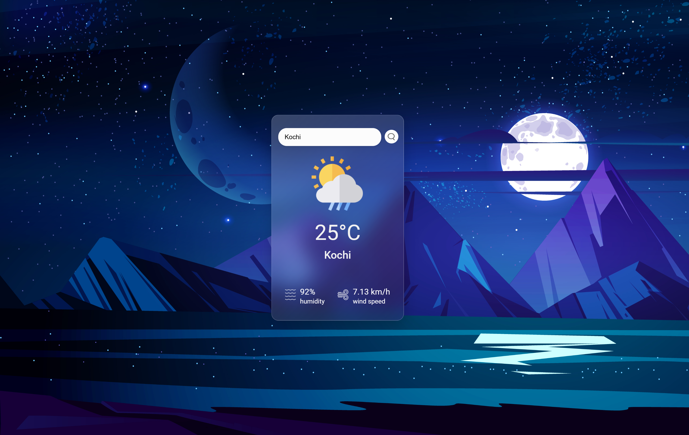

# ⛅ Weather Webpage

A simple and responsive weather application built using **React**. Enter any city to get real-time weather updates like temperature, humidity, and conditions.

---

## 🔗 Live Demo

👉 [Check it out here](https://kichu3000.github.io/weather-webpage/)

---

## 🧠 Features

- 🌍 Search weather by city name
- 🌡️ Displays temperature, weather condition, humidity, and wind speed
- 🔄 Refreshes data in real-time
- 📱 Fully responsive design

---

## 🖼️ Screenshots



---

## 🛠️ Tech Stack

- React.js
- HTML/CSS
- JavaScript (Fetch API)
- [OpenWeatherMap API](https://openweathermap.org/api)

---

## 📦 Installation

```bash
git clone https://github.com/kichu3000/weather-webpage.git
cd weather-webpage
npm install
npm run dev

```

## 📁 Folder Structure

```
weather-webpage/
├── src/
│   ├── components/
│   └── App.jsx
├── public/
│   └── index.html
├── screenshots/
│   ├── home.png
│   └── result.png
├── vite.config.js
├── package.json
└── README.md
```

### 👨‍💻 Author

Made with ❤️ by Kichu
